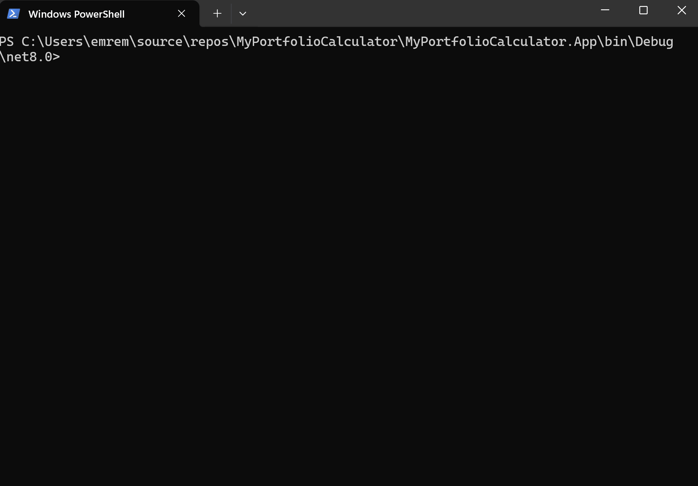

# My Portfolio Calculator

A console application that calculates an investor's portfolio value based on a reference date.

## Overview

This application is built with C# and .NET 8.0. It processes user input containing a date and investor ID to generate portfolio valuations.

## Prerequisites

- .NET 8.0 Runtime ([Download here](https://dotnet.microsoft.com/en-us/download/dotnet/8.0))

## Installation & Running

You can run the application in two ways:

1. **Download the Executable**
   - Visit the Releases page
   - Download the latest executable
   - Open a terminal/console
   - Navigate to the executable location
   - Run the executable

2. **Build from Source**
   - Clone the repository
   - Build the solution using .NET 8.0
   - Run the compiled executable

## Usage

1. The application expects input in the following format:
   ```
   DATE;INVESTOR_ID
   ```

2. Example input:
   ```
   2019-11-17;Investor0
   ```

3. The input must:
   - Use a semicolon (;) as delimiter
   - Include a valid date
   - Include a valid investor ID



## Support

If you encounter any issues or have questions:
- Open an issue on GitHub
- Provide detailed information about your problem
- Include steps to reproduce the issue

## Contributing

Contributions are welcome! Please feel free to submit a Pull Request.
